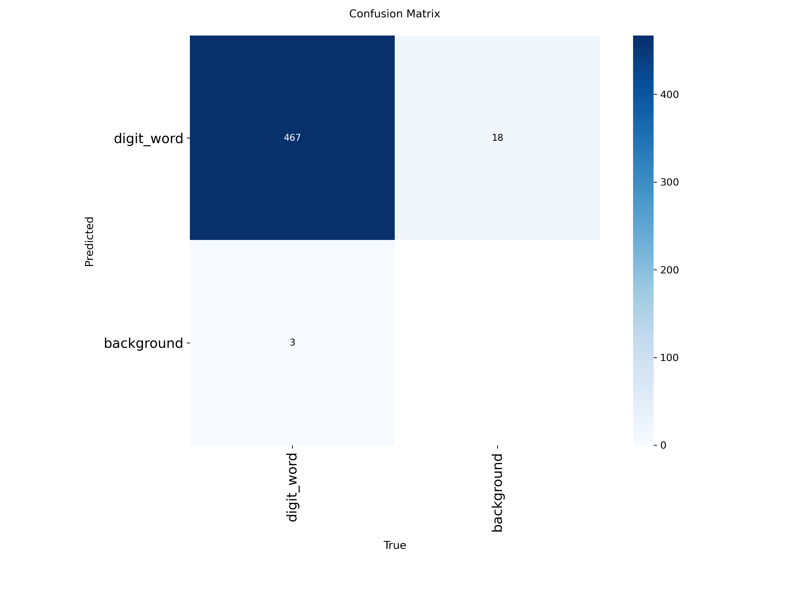

# 🇹🇳 Tunisian License Plate Recognition (Zindi Challenge) 🚗

This project is part of the **Zindi Tunisian License Plate Recognition** challenge. The goal is to detect full license plates, then extract and recognize individual **digits** and the Arabic word **"تونس"** from each plate.

📌 **Current Status**: Work in Progress (WIP)  
✅ License plate detection and digit+word detection models are trained  
🧠 Next steps: OCR/classification and submission logic

---

## 🧪 What This Project Does

### ✅ Done:
- 🔍 **Detect full license plates** using YOLOv8
- 🔠 **Detect individual digits and Arabic word ("تونس")** from cropped license plates
- 🖼️ Visualize detections with bounding boxes

### 🔜 Coming soon:
- 🧠 **Digit classifier or OCR** to convert cropped characters into actual digits/text
- 📄 Generate `submission.csv` for final prediction format
- 🧹 Clean UI + Inference script

---

## 🧰 File & Folder Overview

tunisian-license-plate-ocr/
├── data/
│   └── licence plat challange 1/
│       ├── license_plates_detection_train.csv
│       ├── license_plates_detection_train.zip
│       ├── license_plates_recognition_train.csv
│       ├── license_plates_recognition_train.zip
│       ├── SampleSubmission.csv
│       ├── test.zip
│       └── licence_plate.v1.yolov8.zip

├── models/
│   ├── digit_detectorYoloV8.pt
│   └── licence_platdetectorYoloV8.pt

├── notebooks/
│   └── digit-detector.ipynb

├── outputs/
│   ├── confusion_matrix.png
│   ├── example_car.jpg
│   └── resulats.png

├── .gitignore
├── README.md
└── requirements.txt
## 🔍 Sample Results

### 📌 Example Input

### 🧠 Digit + Word Detection – YOLOv8

### 🔍 Final Detection Results (Plate + Digits)

